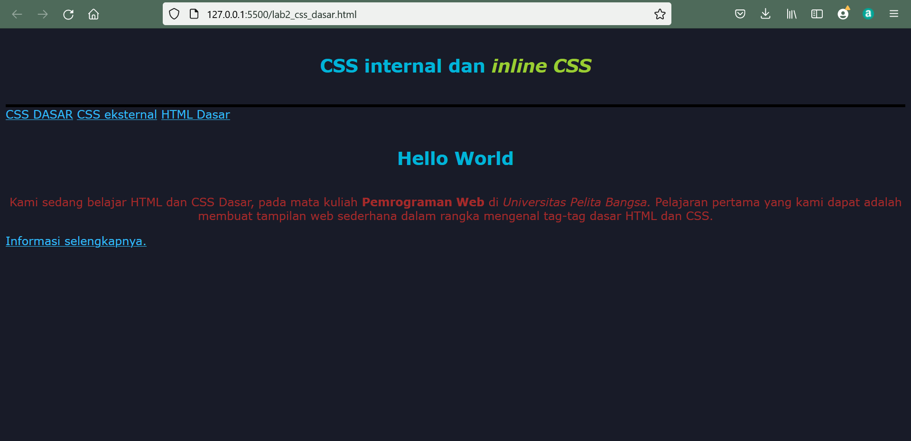
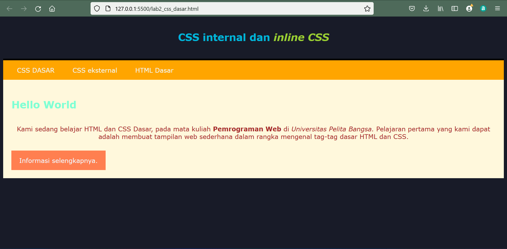

|  Berliana Noviansyah  |     312010373     |
|-----------------------|-------------------|
|        T1.20.A1       |  Pemrograman Web  |
|                 HTML dan CSS              |

# Lab2web
### Praktikum 2 pertemuan 3
Untuk materi kali ini mahasiswa diminta untuk membuat website dengan HTML dan CSS Dasar seperti CSS ***Inline***, ***internal***, dan ***eksternal*** serta selector **ID** dan juga **Class**

## 1). Membuat dokumen dasar HTML
Pada bagian ini terdapat sebuahdokumen dasar HTML yang belum beserta CSS ***inline***, ***internal***, dan ***eksternal***

Adapun contoh codingnya adalah :
```html
<!DOCTYPE html>
<html lang="en">
<head>
    <meta charset="UTF-8">
    <meta http-equiv="X-UA-Compatible" content="IE=edge">
    <meta name="viewport" content="width=device-width, initial-scale=1.0">
    <title>CSS DASAR</title>
</head>
<body>
    <header>
        <h1>CSS internal dan <i>inline CSS</i></h1>        
    </header>
    <nav>
        <a href="lab_css_dasar.html">CSS DASAR</a>
        <a href="lab2_css_eksternal.html">CSS eksternal</a>
        <a href="lab1_tag_dasar.html">HTML Dasar</a>
    </nav>
    <!-- CSS ID Selector -->
    <div id="main">
        <h1>Hello World</h1>
        <p>Kami sedang belajar HTML dan CSS Dasar, pada mata kuliah 
        <b>Pemrograman Web</b> di <i>Universitas Pelita Bangsa.</i> 
        Pelajaran pertama yang kami dapat adalah membuat tampilan web sederhana dalam rangka mengenal tag-tag dasar HTML dan CSS.</p>
        <!-- CSS Class Selector -->
        <a href="#artikel" class="btn">Informasi selengkapnya.</a>
    </div>
</body>
</html>
```

Dan adapun hasil outputannya adalah sebagai berikut :


## 2.Mendeklarasikan CSS Internal
Contoh coding untuk mendeklarasikan CSS internal adalah sebagai berikut :
```css
<style>
        /* CSS Internal*/
        body {
            font-family: Verdana, Geneva, Tahoma, sans-serif;
        }
        header {
            min-height: 90px;
            border-bottom: 4px solid black;
        }
        h1 {
            font-size: 25px;
            color: #00b4d8;
            text-align: center;
            padding: 20px 10px;
        }
        h1 i {
            color: yellowgreen;
        }
    </style>
```
Hasil outputannya adalah sebagai berikut :


## 3.Menambahkan Inline CSS
CSS Inline sendiri adalah CSS yang memiliki prioritas tertinggi jika dideklarasikan secara bersamaan antara internal eksternal dan inline, inline lah yang terpanggil di browser.

Adapun codingnya adalah :
```html
<p style="text-align: center; color: brown;">Kami sedang belajar HTML dan CSS Dasar, pada mata kuliah 
        <b>Pemrograman Web</b> di <i>Universitas Pelita Bangsa.</i> 
        Pelajaran pertama yang kami dapat adalah membuat tampilan web sederhana dalam rangka mengenal tag-tag dasar HTML dan CSS.</p>
```

Dengan hasil output sebagai berikut :


## 4). Membuat CSS Eksternal
CSS Eksternal adalah CSS yang dimana filenya terpisah dengan HTML melalui link penempatannya. CSS Eksternal sangan direkomendasikan oleh para programmer website developer dalam membuat gaya pada CSS.

Dengan hasil coding :
```css
nav{
    background: orange;
    color: aliceblue;
    padding: 15px;
}
nav a{
    color: aliceblue;
    text-decoration: none;
    padding: 15px 20px;
}
nav .active,
nav a:hover{
    background-color: black;
    border-radius: 4px;
}
```

## 5). Menambahkan CSS Selector
CSS selector adalah sebuah pendeklarasian untuk menambahkan gaya pada elemen html seperti selector (p), (h1) dll. Ada juga selector ID yang pendeklarasiannya dalam file CSS yaitu (#) kemudian definisikan properti CSS dalam kurung seperti contoh #nav.

Berikut adalah coding dan hasil outputnya :
```css
/* ID Selector */
#berliana{
    background:cornsilk;
    border: 1px solid cornsilk;
    min-height: 100px;
    padding: 10px;
}
#berliana h1{
    text-align: left;
    border: 0;
    color: aquamarine;
}
/* Class Selector*/
.btn{
    padding: 15px 20px;
    background: coral;
    color: aliceblue;
    display: inline-block;
    margin: 10px;
    text-decoration: none;
}
.btn-primary{
    background: coral;
}
```

